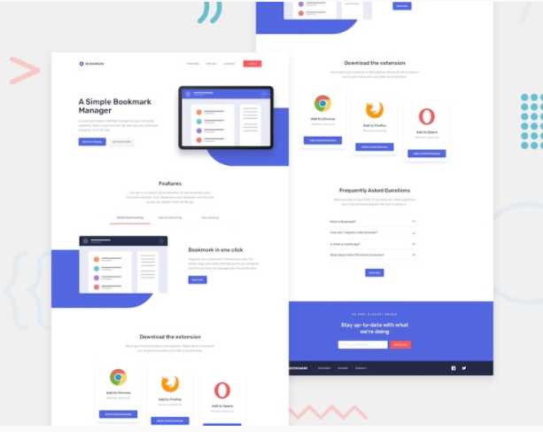
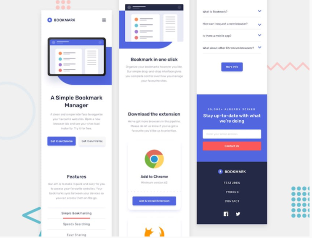

<h2>BookMark Landing Page</h2>

This is my solution to <strong>BookMark Landing Page</strong> challenge by Frontendmentor.io. which is based on simple HTML-CSS and javascript.This challenge will really test our layout skills. There are also areas that will require some JavaScript, such as the tabbed features section and the FAQ accordion.

<h3>Live Link</h3>
<a href="https://sonakshirawat.github.io/Bookmark-landing-page/">Click here</a>

<h3>Features</h3>
<ul>
<li>See the hover states for all the interactive elements on the page</li>
<li>I have created a Frequently Asked Questions(FAQ) accordion using JavaScript. The accordion is used to display the content in list format. It can expand or collapse to display the content it contains.</li>
<li>Receive an error message when the newletter form is submitted if:
<li style="margin-left:20px">The input field is empty</li>
<li style="margin-left:20px">The email address is not formatted correctly</li>
</li>
<li>View the optimal layout for the site depending on their device's screen size</li>
</ul>

 
<h3>Build Using</h3>
<ul>
  <li>HTML5 Markup language</li>
  <li>CSS3 Custom Properties</li>
     <li>Vanilla javascript</li>
</ul>

<h3>Screenshots</h3>

